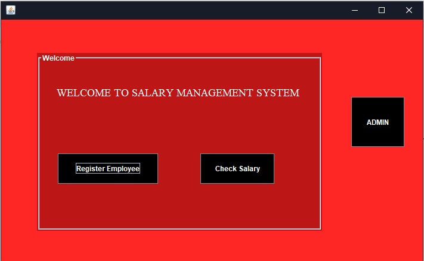
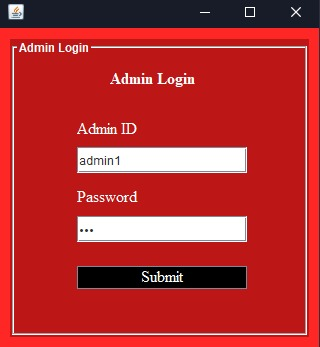
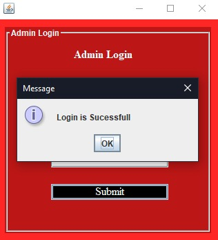

# SalaryManagementSystem
This is Salary Management System where a user can assign respected salary to their employes and here employes can check their salary .
In this project I have Swing for frontend and Oracle Database for backend. 

## Functional Requirement

- 1).Registration
- 2).Login
- 3).Admin Login
- 4).Edit

### Screenshot

